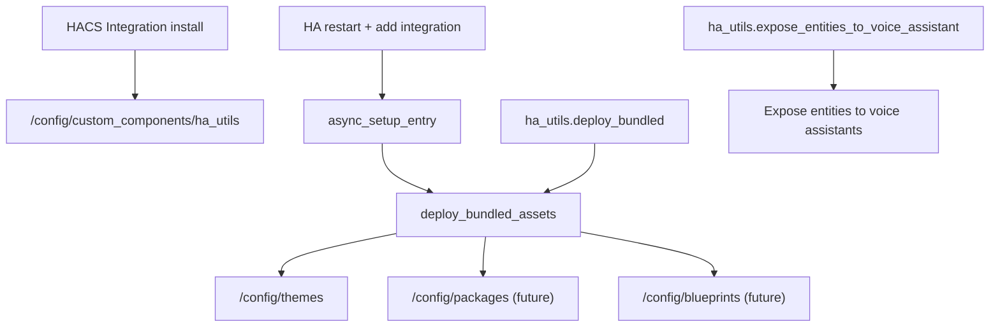

# HA Utils — Bundled Resource Integration

Current plan for the repository.

---

## Goal

Build a HACS custom integration that installs into `/config/custom_components/ha_utils` and deploys bundled Home Assistant resources into the correct `/config` folders.

Current bundled resource:

- `custom_components/ha_utils/bundled/themes/ha_utils_font_scale.yaml`
- `custom_components/ha_utils/bundled/blueprints/automation/ha_utils/*.yaml`

Deployment result:

- `/config/themes/ha_utils_font_scale.yaml`
- `/config/blueprints/automation/ha_utils/*.yaml`

Current bundled automation blueprints:

- High wind alert
- Hot day alert
- Cold day alert
- Possible thunderstorm alert

Future bundled resource types:

- `/config/packages`
- Additional `/config/themes`

---

## Current Tracker

| Area | Status |
|------|--------|
| HACS integration scaffold | Done |
| Config flow | Done |
| Copy-if-missing deployer | Done |
| Manual `ha_utils.deploy_bundled` action | Done |
| Manual `ha_utils.expose_entities_to_voice_assistant` action | Done |
| Bundled font-scale theme | Done |
| Bundled weather automation blueprints | Done |
| README/docs for integration install | Done |
| Tests for theme/deploy layout | Done |

---

## Architecture



---

## Repository Layout

```text
ha-utils/
├── custom_components/
│   └── ha_utils/
│       ├── __init__.py
│       ├── manifest.json
│       ├── config_flow.py
│       ├── const.py
│       ├── deploy.py
│       ├── services.py
│       ├── services.yaml
│       ├── strings.json
│       └── bundled/
│           ├── themes/
│           │   └── ha_utils_font_scale.yaml
│           ├── packages/
│           └── blueprints/
│               └── automation/ha_utils/
├── tests/
│   └── test_theme_pack.py
├── docs/
│   └── PLAN.md
├── Makefile
├── hacs.json
└── README.md
```

---

## Install/Test Flow

1. Add this repository to HACS as category **Integration**.
2. HACS downloads it to `/config/custom_components/ha_utils`.
3. Restart Home Assistant.
4. Add **Home Assistant Utils** from **Settings > Devices & services**.
5. Integration setup copies bundled resources into `/config`.
6. Ensure `/config/configuration.yaml` contains:

   ```yaml
   frontend:
     themes: !include_dir_merge_named themes
   ```

7. Reload themes or restart Home Assistant.
8. Select a theme such as `HA Font 120%` from the theme selector.
9. Open **Settings > Automations & scenes > Blueprints** to create automations from the HA Utils blueprints.
10. Use **Settings > Developer tools > Actions > `ha_utils.expose_entities_to_voice_assistant`** to expose selected entities, or leave selection empty to expose all unexposed entities.

If upgrading from the old test theme, delete `/config/themes/ha_utils_typography.yaml` and reload themes. That old theme used scale `1` and will not increase font size.

---

## Deploy Rules

- Copy-if-missing by default.
- Never overwrite files under `/config` during startup/setup.
- `ha_utils.deploy_bundled` can opt into `overwrite_existing: true` to refresh existing bundled resources after an integration upgrade.
- When overwriting, `backup_existing: true` creates `.bak` files first.
- Bundle paths mirror `/config` destinations:
  - `bundled/themes/foo.yaml` -> `/config/themes/foo.yaml`
  - `bundled/packages/foo.yaml` -> `/config/packages/foo.yaml`
  - `bundled/blueprints/...` -> `/config/blueprints/...`
- `ha_utils.deploy_bundled` re-runs the same deployer for missing files or, when explicitly requested, updates existing files.

---

## Theme Notes

The font themes only set `ha-font-size-scale` in both `light` and `dark` modes; all other values fall back to Home Assistant's built-in light/dark bases.

The Auto/Light/Dark selector is supported through the YAML `modes` structure. The built-in primary/accent color pickers are not preserved for custom themes; those controls are special to the built-in `Home Assistant` theme.

---

## Weather Blueprint Notes

All weather alert blueprints use a `weather` entity as the trigger source:

- High wind uses the weather entity `wind_speed` attribute.
- Hot day uses the weather entity `temperature` attribute and an upper threshold.
- Cold day uses the weather entity `temperature` attribute and a lower threshold.
- Possible thunderstorm uses the weather entity state/condition.

---

## Voice Exposure Notes

`ha_utils.expose_entities_to_voice_assistant` is a Developer Tools action, not a bundled script.

Behavior:

- If entities are selected, expose only those entities.
- If no entities are selected, expose all currently unexposed entities.
- Already exposed entities are skipped.
- Assist (`conversation`) is selected by default.
- Alexa (`cloud.alexa`) and Google Assistant (`cloud.google_assistant`) can also be selected when available.

Home Assistant's action form does not support dynamic filtering of already exposed entities or select-all/unselect-all buttons for custom service fields. That would require a dedicated frontend panel. For now, the backend performs the filtering.
