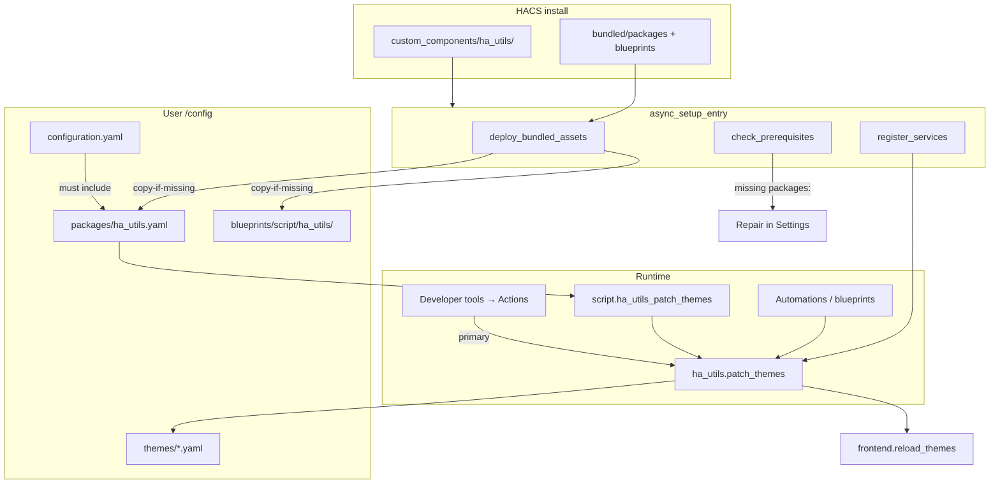

# HA Utils — Blueprints + Packages + Services

Full design and execution plan for this repository. Use this on any machine to continue implementation, deploy to Home Assistant, or add new utilities.

**Integration version:** 1.0.1 (see `custom_components/ha_utils/manifest.json`)

---

## Phase tracker

| Phase | Description | Status |
|-------|-------------|--------|
| 1 | Scaffold integration + HACS | Done |
| 2 | Bundle deploy (copy-if-missing) | Done |
| 3 | Prerequisites + repair issues | Done |
| 4 | Services (Developer tools Actions) | Done |
| 5 | Bundled package YAML | Done |
| 6 | Bundled blueprints | Done |
| 7 | Config flow UX | Done (options re-deploy partial) |
| 8 | Dev tooling (CLI, Makefile, tests) | Done |
| 9 | Documentation | Done |
| — | v1.1: automation blueprints, repair deep-links, `input_number` helper | Not started |
| — | v1.2: per-user frontend font-scale module | Not started |

---

## Goal

Ship a single HACS integration that:

1. **Deploys** bundled YAML (packages + blueprints) into `/config` on first setup — **copy-if-missing**, never overwrite user edits
2. **Registers services (actions)** for Python logic — primary UX is **Settings → Developer tools → Actions**; also callable from package scripts, automations, and blueprints
3. **Surfaces repair issues** when required `configuration.yaml` entries are missing (`packages:` include)
4. **Bundles** reusable blueprints + a drop-in package (optional HA scripts that chain services)

**Out of scope for v1:** dashboard Lovelace buttons/cards for font size, per-user frontend font-scale module, silent `configuration.yaml` editing, overwriting deployed files on upgrade.

---

## Architecture



---

## Repository layout

```
ha-utils/
├── custom_components/
│   └── ha_utils/
│       ├── __init__.py
│       ├── manifest.json
│       ├── config_flow.py
│       ├── const.py
│       ├── deploy.py
│       ├── prerequisites.py
│       ├── repairs.py
│       ├── services.py
│       ├── services.yaml
│       ├── theme_patcher.py
│       ├── strings.json
│       └── bundled/
│           ├── packages/
│           │   └── ha_utils.yaml
│           └── blueprints/
│               └── script/ha_utils/
│                   └── patch_and_reload_themes.yaml
├── scripts/
│   ├── env.py
│   └── scale_theme_fonts.py
├── tests/
│   ├── conftest.py
│   ├── fixtures/sample_theme.yaml
│   ├── test_theme_patcher.py
│   └── test_prerequisites.py
├── docs/
│   └── PLAN.md                 # This file
├── .env.dist
├── .gitignore
├── Makefile
├── hacs.json
└── README.md
```

**Domain:** `ha_utils`  
**Display name:** Home Assistant Utils

---

## Implementation order

Follow this sequence when building from scratch or adding a major feature:

1. Scaffold `ha_utils` integration + HACS metadata (**Phase 1**)
2. `theme_patcher.py` + unit tests (**Phase 4** dependency, **Phase 8**)
3. `services.py` + `services.yaml` — register actions (**Phase 4**)
4. `deploy.py` — copy-if-missing + marker file (**Phase 2**)
5. `prerequisites.py` + `repairs.py` (**Phase 3**)
6. `config_flow.py` + wire `async_setup_entry` (**Phase 7**)
7. Bundled `ha_utils.yaml` package + script blueprint (**Phases 5–6**)
8. README + manual test on real HA instance (**Phase 9**)
9. v1.1+ items at bottom of this document

---

## Phase 1 — Scaffold integration

### 1.1 Core files

| File | Purpose |
|------|---------|
| `custom_components/ha_utils/manifest.json` | `domain`, `name`, `version`, `config_flow`, `requirements: []`, `iot_class: local_polling` |
| `custom_components/ha_utils/config_flow.py` | Single-step flow → create config entry; options flow for re-deploy |
| `custom_components/ha_utils/const.py` | `DOMAIN`, repair issue IDs, defaults, `BUNDLE_VERSION` |
| `custom_components/ha_utils/__init__.py` | `async_setup`: register services; `async_setup_entry`: deploy + repairs |

**Important:** Register services in **`async_setup`** (not only `async_setup_entry`) so actions appear in Developer tools even before a config entry exists. See [HA dev docs — services](https://developers.home-assistant.io/docs/dev_101_services/).

### 1.2 HACS metadata

`hacs.json`:

```json
{
  "name": "Home Assistant Utils",
  "content_in_root": false,
  "filename": "ha_utils",
  "homeassistant": "2024.4.0",
  "render_readme": true
}
```

### 1.3 How to verify

- Copy `custom_components/ha_utils` to a dev HA `/config/custom_components/`
- Restart HA → integration appears under **Settings → Devices & services → Add integration**

---

## Phase 2 — Bundle deploy (copy-if-missing)

### 2.1 Module: `deploy.py`

```python
def deploy_bundled_assets(hass: HomeAssistant) -> DeployResult:
    """Copy bundled files to /config. Never overwrite existing files."""
```

| Rule | Behavior |
|------|----------|
| Copy-if-missing | If destination exists → **skip**, log info |
| Directory merge | Preserve `blueprints/script/ha_utils/...` structure under `/config/` |
| Packages | `bundled/packages/ha_utils.yaml` → `/config/packages/ha_utils.yaml` |
| Marker file | Write `/config/.ha_utils_deployed` JSON: `version`, `deployed_at`, `copied[]` |
| Upgrade | Copy **only new** bundle files; never overwrite existing |

**Do not bundle themes in v1.** Theme patching runs in place via `ha_utils.patch_themes` (writes `.bak` per file).

### 2.2 When deploy runs

- `async_setup_entry` after config entry is created
- `ha_utils.deploy_bundled` action
- Integration **options** flow (re-deploy missing files)

### 2.3 Post-deploy

**Restart Home Assistant** after first package copy. Blueprints are picked up without restart.

### 2.4 How to verify

- Add integration → check `/config/packages/ha_utils.yaml` and `/config/blueprints/script/ha_utils/` exist
- Re-run setup → existing files unchanged (copy-if-missing)
- Check `/config/.ha_utils_deployed` for deploy history

---

## Phase 3 — Prerequisites + repair issues

### 3.1 Module: `prerequisites.py`

Read-only parse of `/config/configuration.yaml`:

```yaml
homeassistant:
  packages: !include_dir_named packages
```

Detect variants: `!include_dir_merge_named`, inline `packages:` block.

Return `PrerequisiteStatus`:

- `packages_enabled`
- `package_file_present` (`packages/ha_utils.yaml` exists)
- `configuration_readable`

**Run in an executor** — `read_text` must not block the event loop:

```python
status = await hass.async_add_executor_job(check_prerequisites, hass)
```

### 3.2 Module: `repairs.py`

| Issue ID | Trigger | User-facing fix |
|----------|---------|-----------------|
| `packages_not_enabled` | No `packages:` under `homeassistant:` | Add snippet below, restart |
| `package_file_missing` | Packages enabled but `ha_utils.yaml` missing | Run `ha_utils.deploy_bundled` |
| `restart_required` | Package file copied this session | Restart HA |

Register with `homeassistant.helpers.issue_registry` (`async_create_issue` / `async_delete_issue`). Translation keys in `strings.json`.

**Snippet for repair UI / README:**

```yaml
homeassistant:
  packages: !include_dir_named packages
```

Integrations **cannot** edit `configuration.yaml` automatically.

### 3.3 How to verify

- HA without `packages:` → repair appears under **Settings → System → Repairs**
- Add `packages:`, restart → `packages_not_enabled` clears
- Delete `packages/ha_utils.yaml`, run `deploy_bundled` → file restored

---

## Phase 4 — Services (actions)

**Primary UX:** **Settings → Developer tools → Actions** — no dashboard buttons required.

`services.yaml` must use **selectors** (number, boolean) so the Actions tab renders a form.

### 4.0 Invocation surfaces

| Surface | Use when |
|---------|----------|
| **Developer tools → Actions** | Manual runs (patch, dry-run, reload) — **default** |
| **Package script** | Automations chaining patch + reload |
| **Blueprint-derived script** | Reusable pattern with UI inputs |
| **Automations** | Scheduled or triggered runs |

### 4.1 `ha_utils.patch_themes`

Logic in `theme_patcher.py`:

- Scan `/config/themes/**/*.yaml`
- `apply_typography_patches(scale, line_height)` — scale, Mushroom keys, card-mod dividers
- Write `.bak` before modify
- `dry_run: true` → log only, no writes

**`services.yaml` fields:** `scale` (0.5–2.5), `line_height` (1.0–3.0), `dry_run` (boolean).

### 4.2 `ha_utils.reload_themes`

Calls `frontend.reload_themes`.

### 4.3 `ha_utils.deploy_bundled`

Re-runs `deploy_bundled_assets`, updates repair issues.

### 4.4 `services.py` registration

```python
hass.services.async_register(DOMAIN, "patch_themes", handle_patch_themes, schema=PATCH_THEMES_SCHEMA)
```

**Critical (v1.0.1):** `async_add_executor_job` does not forward kwargs to the target. Use `functools.partial`:

```python
await hass.async_add_executor_job(
    partial(
        patch_all_themes,
        themes_dir,
        scale=scale,
        line_height=line_height,
        dry_run=dry_run,
    ),
)
```

### 4.5 User workflow

1. Actions → `ha_utils.patch_themes`, `dry_run: true` → check logs
2. Actions → `ha_utils.patch_themes`, `dry_run: false` → apply
3. Actions → `ha_utils.reload_themes`

**YAML mode:**

```yaml
action: ha_utils.patch_themes
data:
  scale: 1.2
  line_height: 1.8
  dry_run: false
```

### 4.6 How to verify

- Actions tab lists all three `ha_utils.*` actions after integration load
- Dry run → log lines `Would patch theme: ...`
- Apply → `.bak` files next to changed themes
- No `unexpected keyword argument 'scale'` in logs

---

## Phase 5 — Bundled package YAML

**File:** `custom_components/ha_utils/bundled/packages/ha_utils.yaml`

**Entity/script prefix:** `ha_utils_*` to avoid collisions.

```yaml
script:
  ha_utils_patch_themes:
    alias: HA Utils — patch themes and reload
    description: >-
      Chains ha_utils.patch_themes and ha_utils.reload_themes.
      For one-off use, prefer Developer tools → Actions.
    sequence:
      - action: ha_utils.patch_themes
        data:
          scale: 1.0
          line_height: 1.8
          dry_run: false
      - action: ha_utils.reload_themes

  ha_utils_patch_themes_dry_run:
    alias: HA Utils — preview theme patch
    sequence:
      - action: ha_utils.patch_themes
        data:
          scale: 1.0
          line_height: 1.8
          dry_run: true
```

**No `input_number` in v1** — pass `scale` in the Actions form. Add `input_number.ha_utils_font_scale` in v1.1 if automations need a persisted knob.

### How to verify

After deploy + restart: `script.ha_utils_patch_themes` exists in **Developer tools → States** or script list.

---

## Phase 6 — Bundled blueprints

### 6.1 Script blueprint (implemented)

**File:** `bundled/blueprints/script/ha_utils/patch_and_reload_themes.yaml`

- Inputs: `scale`, `line_height`, `dry_run`
- Sequence: `ha_utils.patch_themes` → `ha_utils.reload_themes`
- After deploy: visible under **Settings → Automations & scenes → Blueprints → Script**

### 6.2 Automation blueprint (v1.1 — not implemented)

Example: run theme patch when an `input_number` changes. Steps to add:

1. Create `bundled/blueprints/automation/ha_utils/on_font_scale_change.yaml`
2. Use `trigger: state` on `input_number.ha_utils_font_scale`
3. Action: `ha_utils.patch_themes` with templated `scale`
4. Bump `BUNDLE_VERSION` in `const.py`; new file deploys copy-if-missing on upgrade

### How to verify

- Blueprint appears in UI after deploy (no restart required)
- Create script from blueprint → runs patch + reload

---

## Phase 7 — Config flow UX

### 7.1 User flow

1. **Settings → Devices & services → Add → Home Assistant Utils**
2. Confirm → config entry created
3. `deploy_bundled_assets()` in executor
4. `async_update_repairs()` with deploy result
5. Show form description: enable `packages:` + restart if first install

### 7.2 Options flow (partial v1.1)

**Settings → Devices & services → Home Assistant Utils → Configure** → re-deploy missing bundle files.

### 7.3 `__init__.py` wiring

```python
async def async_setup(hass, config):
    async_setup_services(hass)
    return True

async def async_setup_entry(hass, entry):
    deploy_result = await hass.async_add_executor_job(deploy_bundled_assets, hass)
    await async_update_repairs(hass, deploy_result=deploy_result)
    return True

async def async_unload_entry(hass, entry):
    await async_clear_repairs(hass)
    return True
```

### 7.4 v1.1 improvements

- Success dialog with copied file count
- Device page showing bundle version + deployed file list
- Repair “Learn more” deep-link to `docs/PLAN.md` or README anchor

---

## Phase 8 — Dev tooling

### 8.1 `theme_patcher.py`

Canonical patcher logic. Key exports:

- `apply_typography_patches(text, scale=, line_height=)`
- `patch_all_themes(themes_dir, scale=, line_height=, dry_run=)` → `PatchResult`
- `discover_theme_files(themes_dir)`

### 8.2 CLI: `scripts/scale_theme_fonts.py`

```bash
python3 scripts/scale_theme_fonts.py              # dry run
python3 scripts/scale_theme_fonts.py --apply      # write
python3 scripts/scale_theme_fonts.py --themes-dir /path/to/themes --scale 1.2
```

Imports from `custom_components/ha_utils/theme_patcher.py` via `sys.path`.

### 8.3 `scripts/env.py` + `.env.dist`

`HA_FONT_SCALE=1` for `make fonts`.

### 8.4 `Makefile`

```makefile
make test    # pytest tests/
make fonts   # apply patches to ./themes at HA_FONT_SCALE
make help
```

### 8.5 Tests

```bash
pip install pytest
make test
```

| Test file | Covers |
|-----------|--------|
| `tests/test_theme_patcher.py` | calc() rewrites, dry-run, .bak on apply |
| `tests/test_prerequisites.py` | `packages:` detection in configuration.yaml |
| `tests/conftest.py` | Load integration modules without HA installed |

### How to verify locally

```bash
cp .env.dist .env
mkdir -p themes && cp /path/to/your/themes/*.yaml themes/
make fonts FONT_SCALE=1.2
make test
```

---

## Phase 9 — Documentation

### README sections (maintain in `README.md`)

1. Install — HACS, add integration, restart
2. Required `packages:` config + repair explanation
3. **Developer tools → Actions** workflow (primary)
4. Package scripts (optional, for automations)
5. Blueprints — how to import from UI
6. Theme patcher — what changes, `.bak` behavior
7. Upgrade policy — copy-if-missing
8. Limitations — no dashboard UI v1; manual `configuration.yaml`; restart for packages

### This file (`docs/PLAN.md`)

Keep phase tracker and implementation specs updated when adding features.

---

## File-by-file reference

| Module | Responsibility |
|--------|----------------|
| `theme_patcher.py` | Regex/YAML typography patches |
| `deploy.py` | Copy-if-missing bundle → `/config` |
| `prerequisites.py` | Read-only `configuration.yaml` checks |
| `repairs.py` | Create/clear issue registry entries |
| `services.py` | Action handlers + executor wiring |
| `services.yaml` | Actions tab UI metadata |
| `config_flow.py` | Setup + options re-deploy |
| `strings.json` | Config flow + repair translations |

---

## Testing checklist (Home Assistant instance)

| # | Test | Expected |
|---|------|----------|
| 1 | Fresh HA, add integration, no `packages:` | Repair `packages_not_enabled`; bundle files copied |
| 2 | Add `packages:`, restart | `script.ha_utils_patch_themes` exists |
| 3 | Actions: `patch_themes` dry_run | Form shows selectors; logs `Would patch theme:` |
| 4 | Actions: `patch_themes` apply | Themes patched; `.bak` created |
| 5 | Actions: `reload_themes` | Themes reloaded in UI |
| 6 | `script.ha_utils_patch_themes` | Patch + reload via automation path |
| 7 | Re-add / upgrade integration | Existing bundle files **not** overwritten |
| 8 | Actions visible before config entry | Services registered in `async_setup` |
| 9 | Script blueprint in UI | Under `ha_utils/` namespace |

---

## Key design decisions

| Decision | Choice | Rationale |
|----------|--------|-----------|
| Deploy policy | Copy-if-missing only | Protect user edits |
| Python execution | Integration services | Full stdlib; Developer tools Actions |
| Primary UX | Developer tools → Actions | No dashboard UI in v1 |
| Packages enablement | Repair + manual YAML | HA forbids silent config edits |
| Entity prefix | `ha_utils_*` | Avoid ID collisions |
| Themes | Patch in `/config/themes/` via action | No bundled theme files |
| Executor for I/O | `partial()` + `async_add_executor_job` | Avoid event-loop blocking and kwarg bug |

---

## Risks and mitigations

| Risk | Mitigation |
|------|------------|
| User never adds `packages:` | Persistent repair issue |
| Entity ID conflicts | `ha_utils_*` prefix |
| Theme patch breaks custom theme | `dry_run` action; `.bak` per file |
| Blueprint path wrong after deploy | Keep `blueprints/script/ha_utils/` structure |
| Themes directory missing | Clear error in `PatchResult.errors` |
| `async_add_executor_job` kwargs | Always use `functools.partial` |

---

## Future work (v1.1+)

### v1.1

- [ ] Automation blueprint (`on_font_scale_change`)
- [ ] `input_number.ha_utils_font_scale` in package
- [ ] Config flow success dialog with deploy summary
- [ ] Repair deep-links to documentation
- [ ] Device page: bundle version, deployed files list

### v1.2

- [ ] Frontend module: per-user `--ha-font-size-scale` via `frontend/set_user_data`
- [ ] Built-in panel for font size (optional; Actions remain sufficient for many users)

### Adding a new utility action (pattern)

1. Add Python logic module (or extend `theme_patcher.py`)
2. Register service in `services.py` + `services.yaml` with selectors
3. Use `functools.partial` for any executor job with kwargs
4. Optionally add package script + blueprint under `bundled/`
5. Bump `manifest.json` version and `BUNDLE_VERSION`
6. Update README, this plan phase tracker, and tests

---

## Deploy to Home Assistant (quick reference)

```bash
# On dev machine
git clone <repo-url> ha-utils
cd ha-utils
make test

# On HA host (or via Samba/SSH)
cp -r custom_components/ha_utils /config/custom_components/
# Restart HA
# Settings → Devices & services → Add → Home Assistant Utils
# Add packages: to configuration.yaml if needed
# Restart HA again
# Developer tools → Actions → ha_utils.patch_themes
```

Or install via HACS custom repository pointing at this repo.
