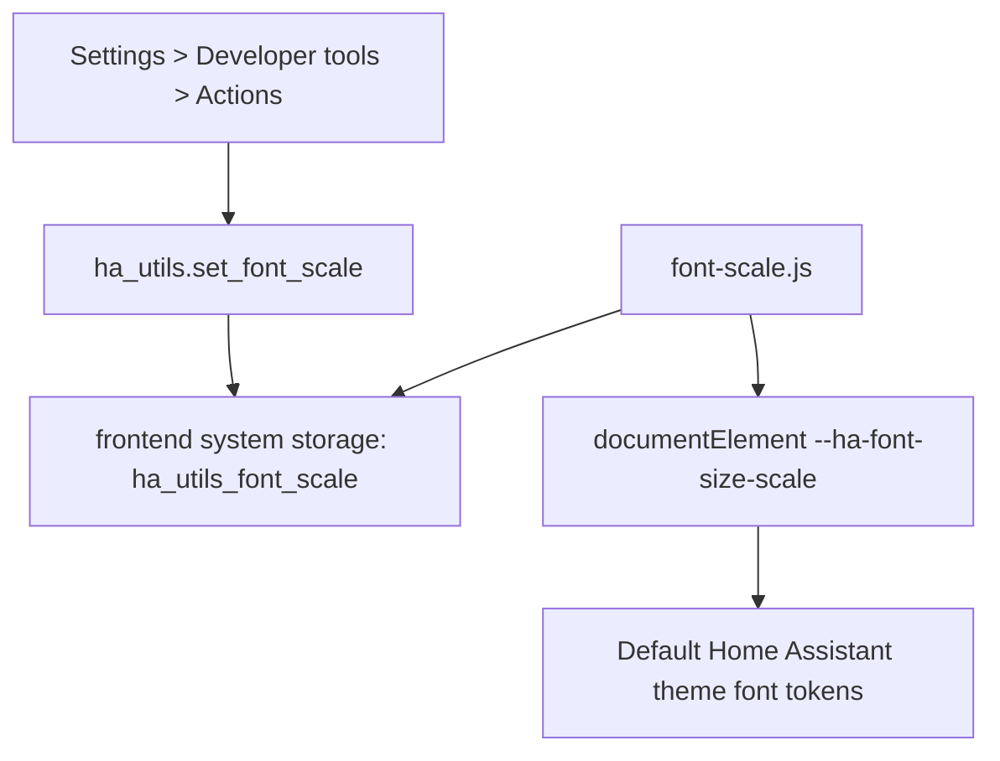

# HA Utils — Default Theme Font Scale

Current plan for the simplified `ha-utils` repository.

**Integration version:** 1.2.0 (see `custom_components/ha_utils/manifest.json`)

---

## Current Goal

Provide one Home Assistant Developer Tools action that updates the default Home Assistant theme font size at runtime.

Primary UX:

1. Open **Settings > Developer tools > Actions**
2. Run `ha_utils.set_font_scale`
3. Enter a `scale` value such as `1.2`

No custom theme YAML files are patched. No `/config/themes` folder is required.

---

## Current Phase Tracker

| Area | Status |
|------|--------|
| HACS custom integration scaffold | Done |
| Config flow | Done |
| Developer Tools action registration | Done |
| Frontend module registration | Done |
| Runtime default-theme font scaling | Done |
| Tests for runtime scale payload | Done |
| README/docs for current scope | Done |

---

## Runtime Architecture



---

## Repository Layout

```text
ha-utils/
├── custom_components/
│   └── ha_utils/
│       ├── __init__.py
│       ├── manifest.json
│       ├── config_flow.py
│       ├── const.py
│       ├── frontend_register.py
│       ├── runtime_scale.py
│       ├── services.py
│       ├── services.yaml
│       ├── strings.json
│       └── frontend/
│           └── font-scale.js
├── tests/
│   ├── conftest.py
│   └── test_runtime_scale.py
├── docs/
│   └── PLAN.md
├── Makefile
├── hacs.json
└── README.md
```

---

## What Remains From The Original Plan

Still present:

- HACS integration scaffold
- Config flow
- Service/action registration
- Developer Tools action as the primary UX
- Runtime frontend module
- Basic tests and documentation

Removed for now:

- Copy-if-missing bundle deployment
- Bundled package YAML
- Bundled blueprints
- `packages:` prerequisite checks
- Repair issues
- Custom theme YAML patching
- Theme path discovery
- `ha_utils.reload_themes`
- Local CLI for patching theme files

Not implemented:

- Rich config-flow success screen
- Device page / diagnostics view
- Dashboard UI or custom panel for font size

---

## Test Checklist

1. Restart Home Assistant after installing or updating the integration.
2. Add **Home Assistant Utils** under **Settings > Devices & services**.
3. Confirm **Settings > Developer tools > Actions** lists `ha_utils.set_font_scale`.
4. Run `ha_utils.set_font_scale` with `scale: 1.2`.
5. Refresh the browser if needed.
6. Verify the frontend applies `--ha-font-size-scale: 1.2`.
